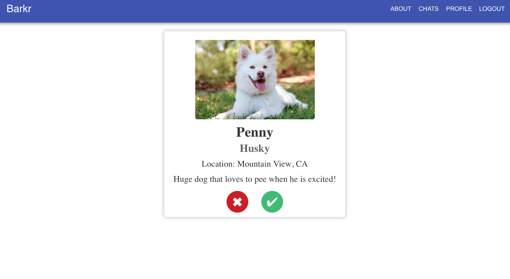

# About

The Popeyes team (CSC 667) is creating an app called Barkr.

Barkr will allow you to find your pet a playdate.

Just swipe right on any fabulous pets you'd like your pet to go on a date with.

# Architecture
`Frontend Stack:` React, Redux, Material UI

`Backend Stack:` Express, MongoDB, Docker, Redis, Websocket

`Main architecture flow;`

 Frontend <--> Microservice Gateway <--> Backend <--> MongoDB
 
 # Technologies Used
 Node
 
 Express
 
 MongoDB
 Passport.js + Passport-JWT
 Microservice architecture (backend -> 5000, frontend -> 3000, websockets -> 6000, gateway -> 4000)
 React
 Redux
 Material UI
 Docker
 NGINX
 AWS EC2

# Images

Login

Viewing other pets in the area

Profile; upload image and update pet profile information

