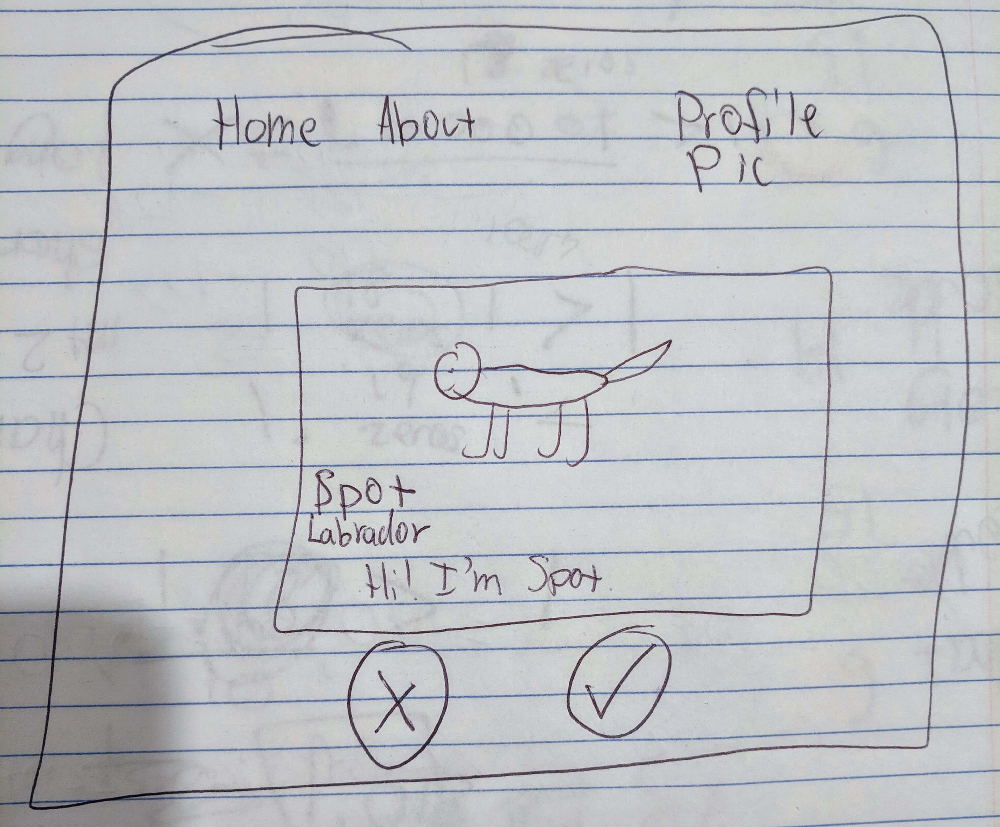

# About

The Popeyes team (CSC 667) is creating an app called Barkr.

Barkr will allow you to find your pet a playdate.

Just swipe right on any fabulous pets you'd like your pet to go on a date with.

# Architecture
`Frontend Stack:` React, Redux, Material UI

`Backend Stack:` Express, MongoDB, Docker, Redis, Websocket

`Main architecture flow;`

 Frontend <--> Microservice Gateway <--> Backend <--> MongoDB

# 

Creating a new account

Viewing other pets in the area

